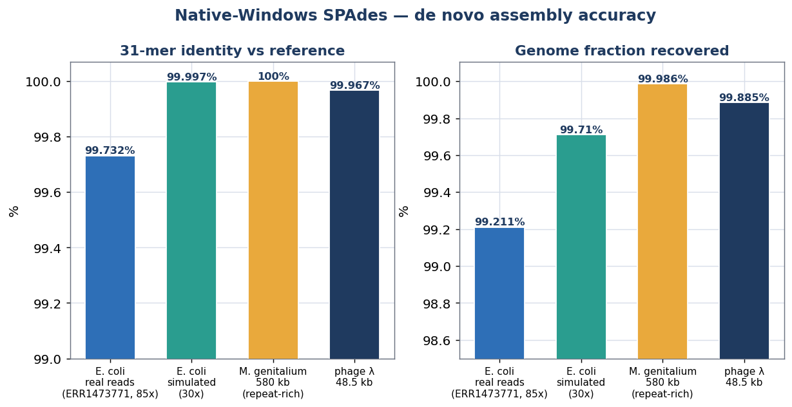
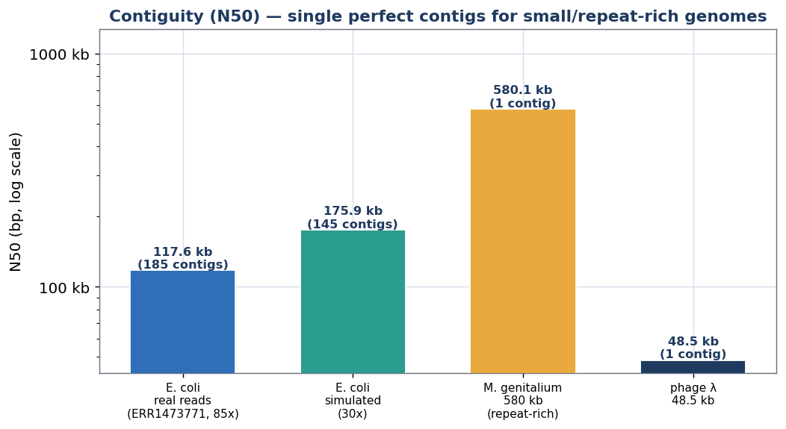
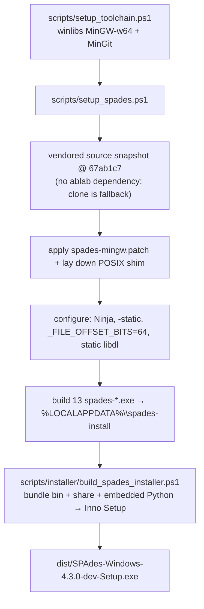
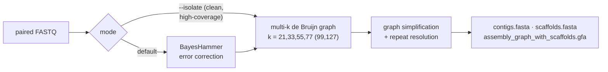
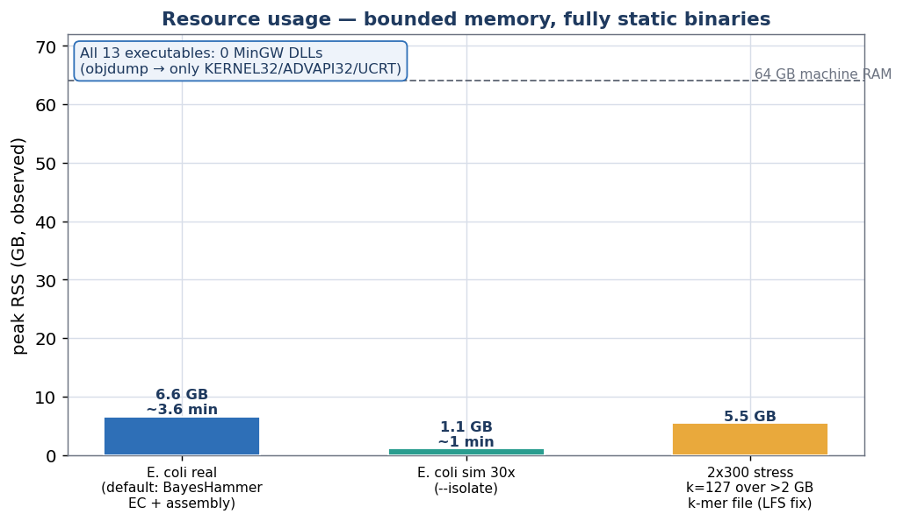

# SPAdes for Windows

[](https://doi.org/10.5281/zenodo.20582190)

> The first **native-Windows** build of the [SPAdes](https://github.com/ablab/spades) genome
> assembler — **no WSL, no Docker, no VM, no Linux**. Nothing to pre-install (not even Python or a
> compiler). All 13 `spades-*` executables are **fully static** — zero MinGW/runtime DLLs.

SPAdes has no native-Windows build upstream: its code assumes char-based
`std::filesystem::path` (on Windows `path::value_type` is `wchar_t`), it vendors a Unix-only
subset of LLVM-Support, and it relies on POSIX (`mmap`, `glob`, `mkdtemp`, …) the MinGW CRT
lacks. This repo carries the from-source fork that clears all of that — distributed as a **git
patch + POSIX shim + build scripts**, plus a **one-click installer** — and validates it
end-to-end on real and simulated bacterial genomes.

**SPAdes 4.3.0-dev** · MinGW-w64 (x86_64) · Windows 10/11 · GPLv2 · patch vs `ablab/spades@67ab1c7`

---

## Quick start — one-click installer (nothing pre-installed)

1. Download **[`dist/SPAdes-Windows-4.3.0-dev-Setup.exe`](dist/)**.
2. Run it. Per-user install (no admin). It adds **“SPAdes for Windows (app)”** (graphical) and a
   **“SPAdes Command Prompt”** to the Start Menu, plus an optional desktop shortcut; you can also
   tick **“Add SPAdes to my PATH”**.

Then use it either way:

### Point-and-click app (recommended for non-technical users)

Launch **“SPAdes for Windows”** from the Start Menu or desktop, then: choose your reads
(forward / reverse), an output folder, and an assembly mode → click **Run assembly** and watch the
live log. When it finishes, **Open output folder** for `contigs.fasta`. It's a minimal front-end
that uses only Windows' built-in PowerShell/.NET — no extra runtime — and drives the bundled SPAdes.

### Command line

From the “SPAdes Command Prompt” (or any terminal, if you added it to PATH):

```bat
spades --help
spades --test                                   :: official E. coli 1K self-test
spades --isolate -1 R1.fq.gz -2 R2.fq.gz -o out_dir
spades -1 R1.fq.gz -2 R2.fq.gz -o out_dir       :: default: with error correction
metaspades | plasmidspades | rnaspades | coronaspades | ...
```

Everything is bundled — the static `spades-*.exe`, `share\spades` (configs, HMM profiles, test
data), an **embedded Python 3.11**, and `.bat` launchers. The classic `spades.py …` works too.
Results land in `-o`: `contigs.fasta`, `scaffolds.fasta`, `assembly_graph_with_scaffolds.gfa`,
`spades.log`. **All 16 modes** run self-contained, including the HMM modes (`--bio` / `--corona`)
and `--iontorrent`. Works from any folder, **including paths with spaces**.

---

## Results

De novo assembly accuracy on real **and** simulated data, scored against each reference by
alignment-free **31-mer identity** (every assembled 31-mer must appear in the reference — catches
any single-base drift) and **genome fraction** (fraction of reference 31-mers recovered):





| Genome | Reads | Contigs | N50 | Largest | Genome fraction | 31-mer identity |
|---|---|--:|--:|--:|--:|--:|
| *E. coli* K-12 MG1655 (4.64 Mb) | **real** — ENA `ERR1473771`, HiSeq 2×100, ~85× | 185 | 117.6 kb | 356.7 kb | **99.21 %** | **99.73 %** |
| *E. coli* K-12 MG1655 (4.64 Mb) | simulated 30×, 2×150 | 145 | 175.9 kb | 327.1 kb | 99.71 % | 99.997 % |
| *M. genitalium* G37 (580 kb, repeat-rich) | simulated | **1** | 580.1 kb | 580.1 kb | 99.99 % | **100 %** |
| phage λ (48.5 kb) | simulated | **1** | 48.5 kb | 48.5 kb | 99.885 % | 99.967 % |

The complete 4.64 Mb *E. coli* chromosome is recovered at ~100 % identity from **real Illumina
reads**; the slightly lower numbers vs the simulated run are *real* — `ERR1473771` is a
laboratory-evolved MG1655 derivative, so the residual reflects genuine strain variation plus
sequencing error, not port drift. The repeat-rich *M. genitalium* chromosome and phage λ each
assemble into a **single perfect contig**. Short-read fragmentation of *E. coli* into ~150 pieces
is expected and correct (contigs break at the seven ~5 kb *rrn* operons and IS elements). Full
method and data in [`docs/`](docs/).

---

## How SPAdes was ported to Windows

```mermaid
flowchart LR
    U["ablab/spades 4.3.0-dev<br/>(Unix-only: no native Windows build exists)"]
    subgraph FIX["Native-Windows port — patch + POSIX shim + build flags"]
      direction TB
      F1["char-based std::filesystem::path<br/>(value_type wchar to char, ~90 sites)"]
      F2["finish the vendored LLVM Unix backend<br/>for Windows (file_t=void*, Path.inc, Process)"]
      F3["POSIX shim: mmap, glob, mkdtemp, rand48<br/>(CreateFileMapping / FindFirstFile)"]
      F4["LLP64 (long is 32-bit): -1ul sentinel,<br/>bitfields, comparators"]
      F5["GCC strict-aliasing: -fno-strict-aliasing<br/>(IonHammer HKMer type-punning)"]
      F6["Large-file support: std::filesystem::file_size<br/>+ _FILE_OFFSET_BITS=64 (>2 GB k-mer files at k=127)"]
      F7["fully static: -static + static libdl/libgomp"]
    end
    U --> FIX
    FIX --> S["13 static spades-*.exe<br/>(0 MinGW DLLs)"]
    S --> I["one-click installer<br/>(+ embedded Python 3.11)"]
```



Each wall is exactly why no native-Windows SPAdes existed before:

| Windows wall | Fix |
|---|---|
| `path::value_type` is `wchar_t` on Windows (char on Unix) — ~90 sites assume char paths | `path.c_str()` → `path.string().c_str()`; SFINAE treats `path` as string-like |
| A vendored, **Unix-only** subset of LLVM-Support | Finish the Windows/Unix split: `file_t=void*`, force-Unix `Path.inc`/`Process`/`Signals`, `convertFDToNativeFile` |
| POSIX the MinGW CRT lacks (`mmap`, `glob`, `mkdtemp`, rand48, `sys/{mman,resource,wait}` …) | Hand-written shim (`CreateFileMapping`/`FindFirstFile`), force-included into every TU |
| **LLP64** — `long` is 32-bit on Windows | 64-bit sentinel (`~uint64_t(0)` not `-1ul`); the repeat-rich-chromosome crash was this one bug |
| GCC **strict-aliasing** miscompiles IonHammer's type-punned HKMer at `-O2` | `-fno-strict-aliasing` on `spades-ionhammer` |
| **>2 GB k-mer files** at k=127: 32-bit `stat`/`off_t` overflow (`EOVERFLOW`, truncated mmap) | `std::filesystem::file_size()` + `-D_FILE_OFFSET_BITS=64` |
| Not fully static — `FindOpenMP`/LLVM picked import lib `libdl.dll.a` | point CMake at static `libdl.a` (`objdump -p` → only system DLLs) |
| `spades.py` config paths with spaces / backslashes break boost's INFO parser | forward-slash + `std::quoted` path values |

Deep dive (with the `gdb` diagnosis of the LLP64 fault) in
[`scripts/spades-patch/README.md`](scripts/spades-patch/README.md).

---

## Build from source

Everything installs into your user profile; **no admin, no Visual Studio**.



```powershell
scripts\setup_toolchain.ps1                       # portable MinGW-w64 + MinGit
scripts\setup_spades.ps1                          # clone @67ab1c7, patch, build static, install
scripts\installer\build_spades_installer.ps1      # -> dist\SPAdes-Windows-<ver>-Setup.exe (needs Inno Setup 6)
```

> **Self-contained builds.** The pinned upstream SPAdes source is vendored as
> [`scripts/spades-patch/spades-src-67ab1c7.tar.gz`](scripts/spades-patch/) (a 17 MB `git archive`
> of commit `67ab1c7`), so a build **never depends on ablab/spades staying online or unchanged** —
> `setup_spades.ps1` extracts the snapshot and applies the patch on top, falling back to a clone
> only if the snapshot is absent.

`setup_spades.ps1` produces the canonical install layout (`bin\` + `share\spades\`) at
`%LOCALAPPDATA%\spades-install`. The binaries are static, so you can run them with stock Windows
Python — no MinGW/MSYS on `PATH`:

```powershell
python %LOCALAPPDATA%\spades-install\bin\spades.py --test
python %LOCALAPPDATA%\spades-install\bin\spades.py --isolate -1 R1.fq.gz -2 R2.fq.gz -o out
```

---

## How an assembly runs



> **Real reads → use the default pipeline.** `--isolate` implies `--only-assembler` (it *skips*
> BayesHammer by design — best for clean, high-coverage data). On noisy reads, run the **default**
> pipeline so error correction collapses the error k-mers first; otherwise the uncorrected
> k-mers inflate the high-k graph.

---

## Performance

Fully static, with **bounded memory** — even on the worst case (a noisy 2×300 set driving k-mer
counting to **k=127 over a >2 GB on-disk k-mer file**, the exact path the LFS fix repairs; it
previously aborted with `stat(2) … value too large`):



`objdump -p` on every executable shows only Windows system DLLs — `KERNEL32`, `ADVAPI32`, and the
UCRT `api-ms-win-crt-*` forwarders — and **no MinGW DLLs** (`libgcc_s`, `libstdc++-6`,
`libwinpthread-1`, `libgomp`, `libdl`).

---

## Validation

Reproduce the de novo numbers (alignment-free, downloads only the reference):

```powershell
python scripts\validation\validate_ecoli.py --spades %LOCALAPPDATA%\spades-install\bin\spades.py --workdir C:\spdval
# real reads (default pipeline, with error correction):
python scripts\validation\validate_ecoli.py --spades ...\spades.py --workdir C:\spdval --reads1 R1.fastq.gz --reads2 R2.fastq.gz
```

Metrics JSON for every panel live in [`docs/`](docs/) (`ecoli_realreads_metrics.json`,
`ecoli_denovo_metrics.json`, `mgenitalium_metrics.json`, `metrics.json`).

---

## Layout

```
SPAdes-for-Windows/
├─ dist/SPAdes-Windows-4.3.0-dev-Setup.exe   # one-click installer (static exes + embedded Python + GUI)
├─ gui/                                       # minimal point-and-click front-end (PowerShell + WinForms)
│  ├─ spades-gui.ps1                          # the app (no extra runtime; drives the bundled SPAdes)
│  └─ SPAdes-GUI.vbs                          # console-less launcher
├─ scripts/
│  ├─ setup_toolchain.ps1                     # portable MinGW-w64 + MinGit
│  ├─ setup_spades.ps1                        # clone @67ab1c7, patch, build static, install
│  ├─ installer/                              # build_spades_installer.ps1 + spades_windows.iss
│  ├─ spades-patch/
│  │  ├─ spades-mingw.patch                   # git diff vs ablab/spades@67ab1c7 (~102 files)
│  │  ├─ spades-src-67ab1c7.tar.gz            # vendored pinned upstream source (self-contained build)
│  │  ├─ shim/                                # hand-written POSIX shim
│  │  └─ README.md                            # the port, fix-by-fix (LLP64, LFS, strict-aliasing, …)
│  └─ validation/validate_ecoli.py            # alignment-free de novo validation
├─ docs/                                      # charts + per-genome metrics JSON
└─ LICENSE                                    # GPLv2
```

## Citing

**If you use this port, please cite both the upstream tool and this repository:**

- **SPAdes** — Bankevich A. *et al.* (2012) *SPAdes: a new genome assembly algorithm and
  its applications to single-cell sequencing.* **Journal of Computational Biology**
  19(5):455–477. doi:[10.1089/cmb.2012.0021](https://doi.org/10.1089/cmb.2012.0021)
  (see also Prjibelski et al., *Curr. Protoc. Bioinformatics* 2020,
  doi:[10.1002/cpbi.102](https://doi.org/10.1002/cpbi.102)).
- **this Windows port** — Sheridan, A. *SPAdes for Windows (native port).* Zenodo.
  doi:[10.5281/zenodo.20582190](https://doi.org/10.5281/zenodo.20582190) —
  https://github.com/MrMufasii/SPAdes-for-Windows. A machine-readable
  [`CITATION.cff`](CITATION.cff) is included.

> Example methods sentence: *“Assembly was performed with SPAdes (Bankevich et al.,
> 2012) via the native-Windows port (Sheridan, 2026;
> doi:10.5281/zenodo.20582190).”*

---

## License

The SPAdes port is distributed as a **patch** against
[ablab/spades](https://github.com/ablab/spades) (not a redistribution of SPAdes source). SPAdes is
**GPLv2**, which applies to anything built from the patched tree, including the bundled installer.
See [`LICENSE`](LICENSE). The shim and build scripts in this repo are provided under the same terms.
